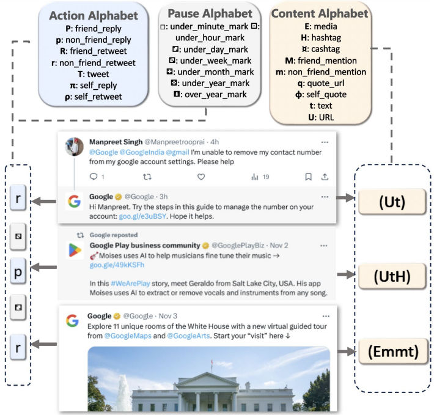
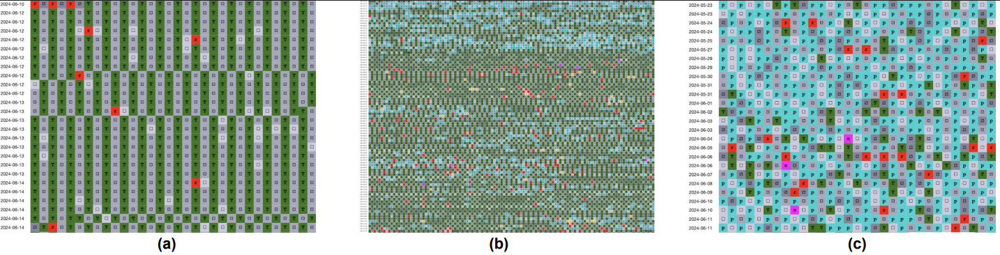
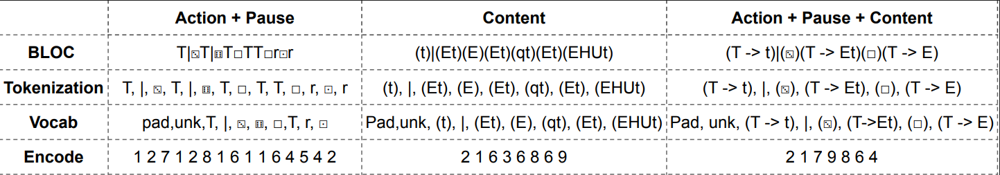
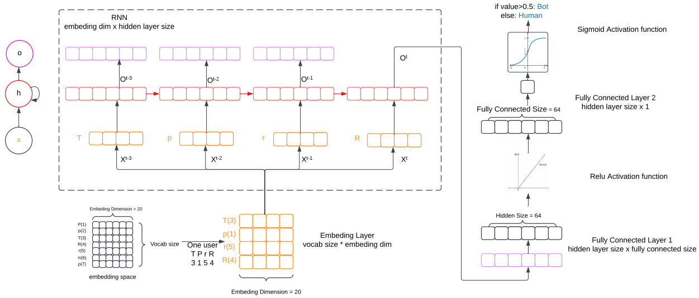
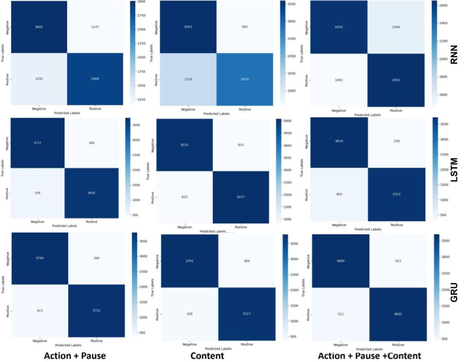

# Learning Behavioral Dynamics for Suspicious Activity Detection in Social Media

This project explores social media bot detection by modeling how user behavior evolves over time. Unlike traditional methods that rely on static features (e.g., profile data or posting frequency), our approach combines the Behavioral Languages for Online Characterization (BLOC) framework with LSTM networks to capture both actions and their temporal dynamics.

By translating raw social media activity into symbolic sequences and learning from their progression, the system can effectively distinguish human users and automated bots. Our experiments show that explicitly modeling behavioral dynamics leads to higher detection accuracy and greater resilience against adversarial tactics.

---

## 📂 Dataset
We use datasets from the [Bot Repository](https://botometer.osome.iu.edu/bot-repository/datasets.html), which include labeled human and bot accounts across multiple domains (political, commercial, general).  

- Total accounts: **40,604** (18,560 bots, 22,044 humans)
- Tweets analyzed: **10 million+**
- Each account is limited to its first 300 tweets, with a minimum threshold of 20 tweets.

### Dataset Summary  

| Source                | Bot   | Human | Total |
|-----------------------|-------|-------|-------|
| botometer-feedback-19 | 140   | 380   | 520   |
| botwiki-19            | 697   | 0     | 697   |
| cresci-17             | 7,295 | 2,770 | 10,065 |
| cresci-rtbust-19      | 352   | 340   | 692   |
| cresci-stock-18       | 7,104 | 6,178 | 13,282 |
| gilani-17             | 1,086 | 1,434 | 2,520  |
| midterm-18            | 0     | 7,459 | 7,459  |
| political-bots-19     | 62    | 0     | 62     |
| varol-17              | 736   | 1,497 | 2,233  |
| vendor-purchased-19   | 1,088 | 0     | 1,088  |
| verified-19           | 0     | 1,986 | 1,986  |
| **Total**             | 18,560| 22,044| 40,604 |

---

## 🧩 Methodology

### 1. BLOC Framework
BLOC encodes user behavior into symbolic “BLOC strings” using multiple alphabets:
- **Action Alphabet:** tweet, retweet, reply  
- **Content Alphabet:** hashtags, mentions, links  
- **Pause/Time Alphabet:** intervals between actions  

<p align="center">
  
</p>

<p align="center"><em>
Fig. 1.BLOC change of Twitter accounts: (a) @FoxNews, (b) @TEN_GOP, (c) @elonmusk
</em></p>

This representation captures not only *what* actions were taken, but *when* and *how often*, revealing distinctive behavioral signatures.  

### 2. Capturing Behavioral Changes
- **Bots:** repetitive patterns with minimal variation with highly irregular shifts  
- **Humans:** moderate, organic variation  

<p align="center">
  
</p>

<p align="center"><em>
Fig. 2. BLOC change of Twitter accounts: (a) @FoxNews, (b) @TEN_GOP, (c) @elonmusk
</em></p>


### 3. Data Preprocessing


Data Preprocessing

  
We experimented with three representations:  
1. **Action + Pause**  
2. **Content**  
3. **Combined Action + Content + Pause**  

Steps:  
- Tokenization (actions, pauses, content features)  
- Vocabulary mapping  
- Padding for sequence consistency  

<p align="center">
  
</p>  

<p align="center"><em>
Fig. 3. Tokenization and encoding examples for three BLOC representations. Each illustrates how user actions, content, and timing are tokenized, mapped to a vocabulary, and encoded for model input
</em></p>

### 4. Model Architecture
We trained three recurrent neural networks:  

- **Vanilla RNN** (baseline)  
- **LSTM** (handles long-term dependencies)  
- **GRU** (lightweight alternative)  

Each model includes:  
- Embedding layer (dim = 20)  
- Recurrent layer (RNN, LSTM, or GRU)  
- Fully connected layers + ReLU  
- Sigmoid output for binary classification  

<p align="center">
  
</p>  
<p align="center"><em>
Fig. 4. Model Architecture
</em></p>

---

## 📊 Results

| Model | Input Representation | Accuracy | F1-Score |
|-------|----------------------|----------|----------|
| RNN   | Action + Pause       | 83.85%   | 83.83%   |
| RNN   | Content              | 60.51%   | 60.44%   |
| RNN   | Combined             | 83.36%   | 83.36%   |
| LSTM  | Action + Pause       | **91.11%** | **91.11%** |
| LSTM  | Content              | 90.30%   | 90.30%   |
| LSTM  | Combined             | 88.65%   | 88.65%   |
| GRU   | Action + Pause       | 90.06%   | 90.06%   |
| GRU   | Content              | 88.90%   | 88.90%   |
| GRU   | Combined             | 86.67%   | 86.67%   |

<p align="center">
  
</p>  
<p align="center"><em>
Fig. 5. RNN, LSTM, GRU confusion matrices for the test dataset
</em></p>

---

## 💡 Conclusion

This project demonstrates that **explicitly modeling behavioral dynamics** via BLOC + LSTM yields a robust and generalizable framework for detecting bots and suspicious accounts.  

- **Action + Pause** was the most effective representation to capture the temporal dynamics.
- LSTM outperformed both RNN and GRU, due to its ability to capture both short- and long-term dependencies 
- Best performance: **91.11% accuracy / F1-score with LSTM + Action + Pause input**.  

Our approach offers resilience against adversarial tactics and lays the foundation for scalable, behavior-based monitoring systems.  

---

## 📖 References
- Nwala, A.C., Flammini, A., & Menczer, F. (2023). *A language framework for modeling social media account behavior*. EPJ Data Science, 12(1), 33.  
- Bot Repository Datasets: [https://botometer.osome.iu.edu/bot-repository/datasets.html](https://botometer.osome.iu.edu/bot-repository/datasets.html)  

---

## 🚀 How to Run

### 1. Clone the repository
```bash
git clone https://github.com/GANGANI/learning-behavioural-dynamics.git
cd learning-behavioural-dynamics
```

### 2. Create and activate a virtual environment

**Mac / Linux**
```bash
python3 -m venv venv
source venv/bin/activate
```

**Windows (cmd)**
```cmd
python -m venv venv
.\venv\Scripts\activate.bat
```

### 3. Install dependencies
```bash
pip install --upgrade pip
pip install -r requirements.txt
```

### 4. Prepare the dataset
Download the datasets from [Bot repository](https://botometer.osome.iu.edu/bot-repository/datasets.html) and place the retraining dataset in the project root with the following structure:
```text
data/
  ├── astroturf/
  │     ├── tweets.jsons.gz
  │     └── userIds.txt
  ├── botwiki/
  │     ├── tweets.jsons.gz
  │     └── userIds.txt
```

Ensure these files exist in the project root:
```text
bloc_generator.py
requirements.txt
lstm.ipynb
lbd-detector.py
```

### 5. Generate BLOC strings
```bash
python bloc_generator.py --path data
```

### 6. Run the analysis
This runs the notebook pipeline and saves a timestamped notebook (e.g., `lstm_20250907_120000.ipynb`).
```bash
python lbd-detector.py
```


